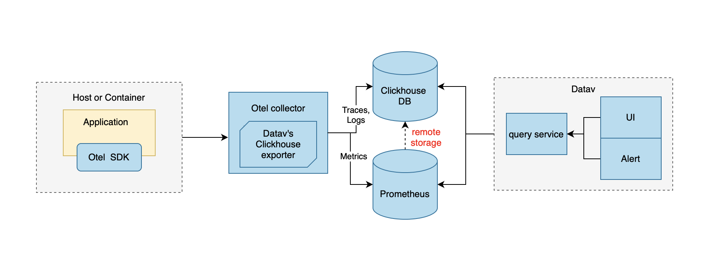
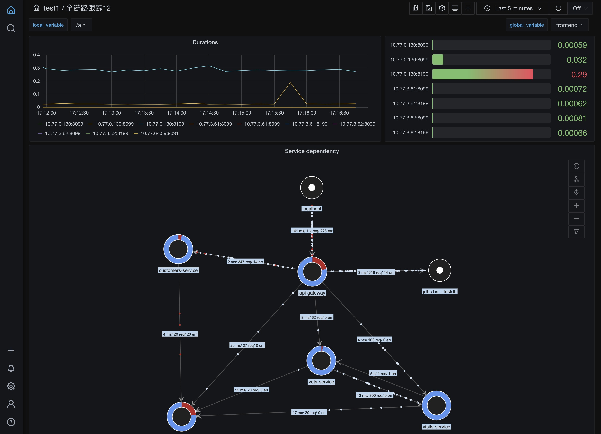
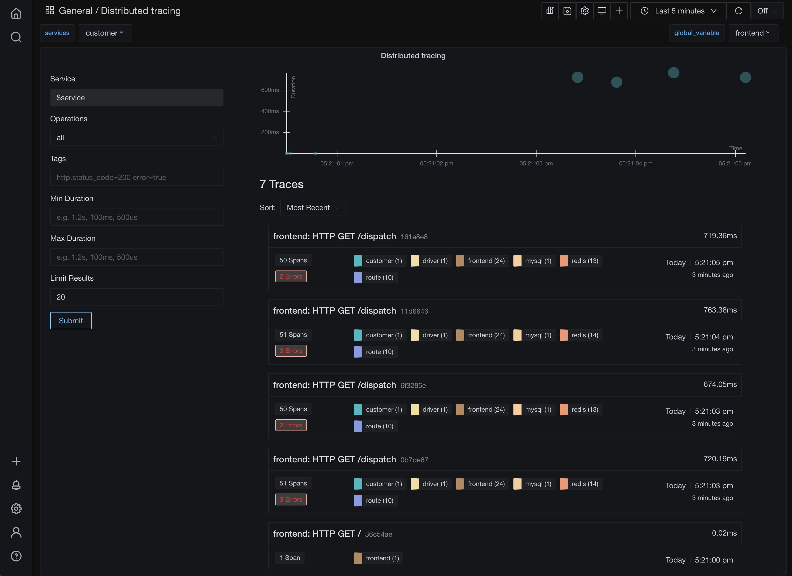
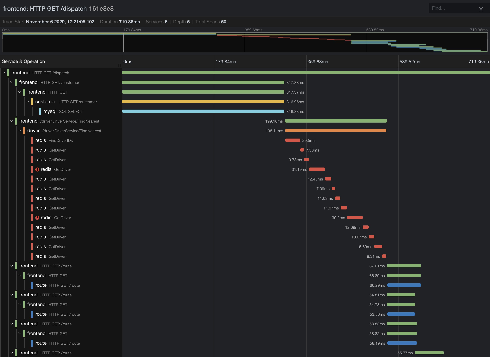

  

  
A modern apm solution for enterprise, an open-source alternative to DataDog, New Relic, etc.

  

     </a>
     </a>
     </a>

<h3 align="center">
  <a href="https://datav.io/docs"><b>Documentation</b></a> &bull;
  <a href="https://github.com/datav-io/datav/blob/main/README_CN.md"><b>ReadMe in Chinese</b></a> &bull;
</h3>

Datav is a modern apm solution for enterprises:
👉 100% open source, keep your source code and data in your own infra

👉 Grafana like ui, more beautiful and powerful, seamlessly integrated with APM features.

👉 Unified UI for traces,metrics,logs, so you can see them in the same place, solve problems much more quickly and very convenient for ops

👉 Datav is built in GO、RUST and Clickhouse, so it's lightning fast. This will help you SAVE huge amount of COST

## Some Features 
- **Traces,Metrics,Logs** native support for @open-telemetry
- **Plugins** grafana like plugins,build your own charts
- **Dynamic Dashboards** grafana like dashboard
- **Interactive Panel** You can set click events for panels, like: go to a page, set variable etc
- **Beautifult Large Screen** Customize your own big data large screen,it's very very cool
- **Alerting** Visually define alert rules for your most important metrics
- **Teams and ACL** Besides global dashboards, you can create teams, manage and share dashboards in your team
- **Custom sidemenu**  Link dashboards to sidemenu items, build your own sidemenu and websites.

## Architecture

## Visitors Count

## Screenshots

