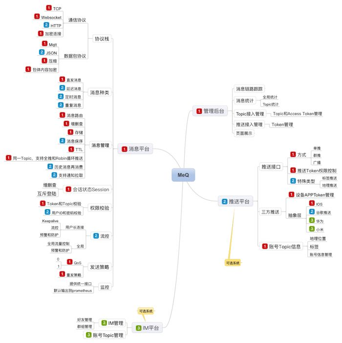
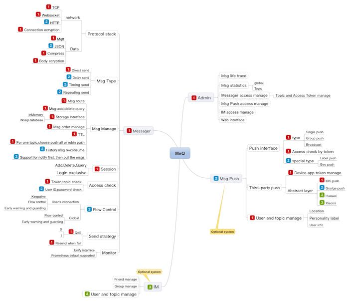

# MeQ [mi:kju]

MeQ— A new composable messaging platform for Message Queue/ Push、IM、IoT etc.
MeQ is written in pure go, so you can easily deploy a standalone binary in linux、unix、macos、windows,  it's **cloud native**.

Develop status
---
This project is under re-develop, the release date is around 2018-05-30

Design Goals
------------
- **HA** : Replication and Data migration
- **Scale out** : Sharding and Consistent hash
- **Massive throughput**
- **Very low latency**
- **Qos 0 and 1 supported**
- **Delay 、Timing and Repeated send supported**
- **History Consuming**
- **Message Durable and TTL supported**
- **Message life trace**
- **Ops friendly**
- **Beautiful web interface**
- **Variety of clients Supported**

Key Features 
------------
- **Extremely Performance** 
- **Always Secure**
- **Mqtt protocol** 
- **Websocket、Tcp**
- **Open source, No commercail**
- **message Pub/Sub**
- **Message Queue supported**
- **Message Push supported**
- **IM chat supported** 

Product Architecture
------------

### Chinese

### English

