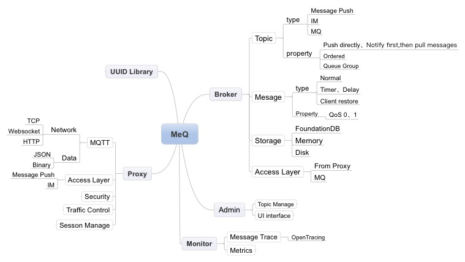

MeQ [mi:kju]
------------
A modern messaging platform for Message Push、IM、Group Chatting、IoT etc. MeQ is written in pure go and standard library,nearly no messy dependencies. so you can easily deploy a standalone binary in linux、unix、macos、windows.

Our goal is to be the best messaging platform in the world, like the iphone to others.

- Homepage: http://meq.io
- <a href="ReadmeCn.md">中文Readme</a>
<p align="left">
    <a href="http://meq.io">
     </a>
</p>

Example of Chatting room
------------
### Download meq
```bash
go get github.com/cosmos-gg/meq
```
### Start meq broker

```bash
> cd $GOPATH/src/github.comcosmos-gg/meq/broker
> go run main.go
```

### Start chatting example
```bash
> cd ../demos/chatting
> npm install
> npm run dev
```
### Chatting now!
Open your browser and accsess http://localhost:8080 in two seperate pages,in one page input username A,in other page input username B, then you can start chatting!

### Tips
You can refresh page of user A, then use B sending several messages, go back to page A and input username A, and see what happens: 
A will get all the history messages and all the unread messages.

Now Status
------------
The version is Alpha V0.5.0. The website,documents and a group chat demo will soon be possible to access(before 2018.6.30)

Features
------------
### Extremely performant
- Written in go, as fast as c/c++ network programing
- Zero allocation and copy
- Hot path and algorithm optimized
### Easy and efficient
- Easy to study and use
- Efficient when you need to develop on meq,because the nice design and code
- Detailed docs and examples
### Robust
- Robust is one of our most important goal throughout the developing
- Default message persistent,also you can implement the persistent inteface in your way.
### Various scenario supported
- Message push
- Group chatting
- IM
- IoT messaging
- Real time Web interaction,like dashboard、online collaboration etc
### Group chat
- Join and leave the group
- Each user has a separate unread message number,e.g. you have 97 unread messages in ethereum-welcom group
- You can retrive your message even after sended
- History messages playback
- Query all the users or online users in the group
- Every message will store only once, all the users share the message
### Advanced feature
- Topic wild match, e.g. you can  push to /china/+/city1, then **all** the **china** province which has city named **city1**, will receive the message.
- Mqtt and websocket,tcp etc
- Low latency, message push deliver to user as soon as possible
- Fertile administrator features and ui
- Monitor and message trace

Why MeQ? 
------------
There were already many messaging platform out there, but none of them can satisfy all the messaging scenario, e.g., if you want build a online chatting platform, you need to build it from scratch, nearly none of the existing platform can satisfy your need. So here meq comes, cover your messaging scenario in the most easy way.

Contribute
------------
Want to be part of the meq project? Great! All are welcome! We will get there quicker together :) Whether you find a bug, have a great feature request or you fancy owning a task from the road map, you can leave a issue.


Contributors(Sort by contribution)
------------
- <a href="https://github.com/sunface" target="_blank">Sunface</a> 
- <a href="https://github.com/shaocongcong" target="_blank">Cong</a>
- <a href="https://github.com/niyuelin1990" target="_blank">Niyuelin1990</a>

Performance(early stage)
-------------
In this benchmark, I use the memory engine, all is done in my macbook pro laptop.
- A client with 5 goroutine can publish 2700K messages to meq per second
- A client with 5 goroutine can consume 2000K messages from meq per second


Architecture
------------



